# learn-file-storage-s3-typescript-starter (Tubely)

This repo contains the starter code for the Tubely application - the #1 tool for engagement bait - for the "Learn File Servers and CDNs with S3 and CloudFront" [course](https://www.boot.dev/courses/learn-file-servers-s3-cloudfront-typescript) on [boot.dev](https://www.boot.dev)

## Quickstart

*This is to be used as a *reference\* in case you need it, you should follow the instructions in the course rather than trying to do everything here.

## 1. Install dependencies

- [Typescript](https://www.typescriptlang.org/)
- [Bun](https://bun.sh/)
- [FFMPEG](https://ffmpeg.org/download.html) - both `ffmpeg` and `ffprobe` are required to be in your `PATH`.

```bash
# linux
sudo apt update
sudo apt install ffmpeg

# mac
brew update
brew install ffmpeg
```

- [SQLite 3](https://www.sqlite.org/download.html) only required for you to manually inspect the database.

```bash
# linux
sudo apt update
sudo apt install sqlite3

# mac
brew update
brew install sqlite3
```

- [AWS CLI](https://docs.aws.amazon.com/cli/latest/userguide/getting-started-install.html)

## 2. Download sample images and videos

```bash
./samplesdownload.sh
# samples/ dir will be created
# with sample images and videos
```

## 3. Configure environment variables

Copy the `.env.example` file to `.env` and fill in the values.

```bash
cp .env.example .env
```

You'll need to update values in the `.env` file to match your configuration, but _you won't need to do anything here until the course tells you to_.

## 3. Run the server

```bash
bun run src/index.ts
```

- You should see a new database file `tubely.db` created in the root directory.
- You should see a new `assets` directory created in the root directory, this is where the images will be stored.
- You should see a link in your console to open the local web page.


# Extras: Localstack instead of aws
In order to freely practice AWS, I've setup an `.envrc` file to "source".
This file ensure to alias `aws` cli to use the `localstack` local cloud emulator.
This emulate cloud service using the real `aws` command, but instead of using the real
aws service provider, we use a local cloud emulator instead.

Motivation: Usings AWS without cost.

### How to set environment
Manually: Make sure to run `source ./envrc` 
Automatically: this is manually done when running the `dev` command.
See `package.json > scripts.dev `

```mermaid
graph TB
    subgraph "🗂️" Project
        1(source _./envrc_)
    end
    subgraph "💻" Machine's Root
        2(
            'aws' executable wrapper:
            _~/usr/aws-shim/aws_
        )
        3(
            'aws' config path:
            _~/usr/.aws/_
        )
        3-1(
            'aws' config
            _~/usr/.aws/config_
        )
        3-2(
            'aws' credentials
            _~/usr/.aws/credentials_
        )

        3 -- read --> 3-1
        3 -- read --> 3-2

    end
1 -- Sets 'aws' variables AWS_ENDPOINT_URL, AWS_PROFILE & the command path to be 'aws-shim' --> 2
2 -- Executes aws with the provided arguments --> 3
```




### Workflow
_If a new terminal is launched, re-source the file `./.envrc`_

| Step | Command | Description |
|------|---------|-------------|
| 1 | `localstack start` | use the cloud emulator |
| 2 | `source ./.envrc` | source what to use for aws-shim & config |
| 3 | `aws <ANY-COMMANDS>` | execute aws command without worrying about the endpoint-url or profile to use |